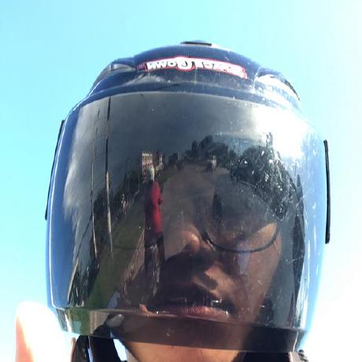

# T2lxddd.github.io
- Kitchakan
  - Tar
  - 6530200011
- 

-[Null cipher](null-cipher)

-[E-card Christmas](ecard.md)

-[Validity](validity.md)

-[Board Game](boardgame.md)

-[Security Control](securitycontrol.md)

**Project**

-[SA Project](https://drive.google.com/file/d/1Ltk4dYusU5IyIrFjwXEepHJzETcFcyCY/view)

-[AI Project : Object Detect](https://colab.research.google.com/drive/1hRJlCDvDuMALCEa2_PLdJ4BU5yyAdzG_?usp=sharing)

-[Busines Data : Rail Freight Transportation Statistics](https://public.tableau.com/app/profile/siravet.nijnirundkul/viz/StoryFinal_17292375103370/Story1?publish=yes)

-[Com Programing Project : Kitchakan Water](https://drive.google.com/drive/u/3/folders/1J__XM2X725vBoighQAbyrm3NxdNPhl3y)

