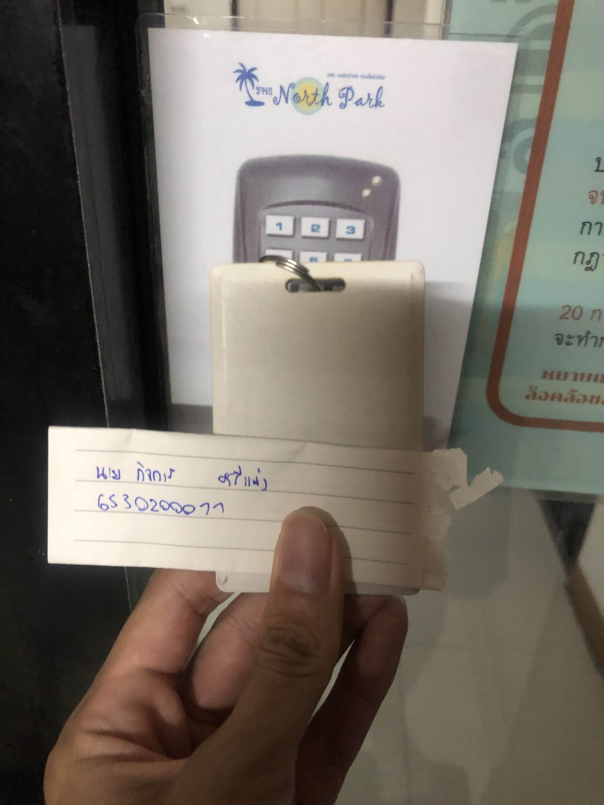

**🔐 Security Control**

**การสแกนคีย์การ์ดเข้าหอพัก**

**Location** : นอร์ทปาร์ค คอนโดมีเนียม

**✨Control Function**: Preventative

**✨ทำไมการสแกนคีย์การ์ดเข้าหอพักจึงเป็น Physical Control ประเภท Preventative** : 

   เพราะเป็นมาตรการที่ใช้ป้องกันการเข้าถึงพื้นที่หรือทรัพย์สินโดยใช้วิธีการทางกายภาพ เช่น ประตูล็อก รั้ว กล้องวงจรปิด เป็นต้น
ซึ่งคีย์การ์ดเป็นอุปกรณ์ที่ใช้ในการควบคุมการเข้าถึง (Access Control) โดยกำหนดให้เฉพาะผู้ที่มีคีย์การ์ดมีสิทธิ์สามารถเข้าไปในพื้นที่ได้
